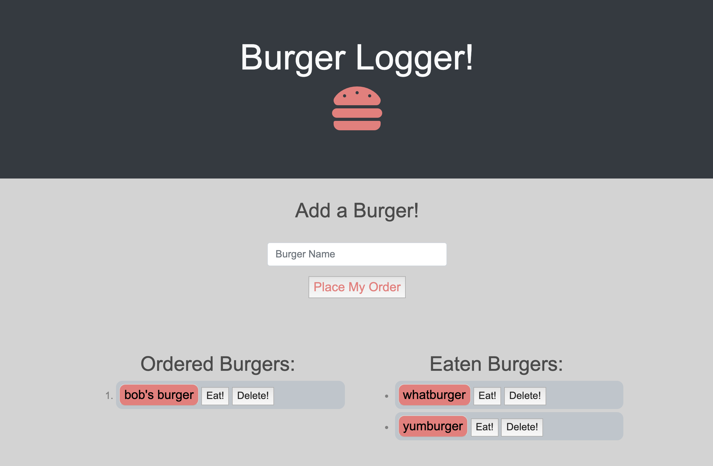

# burger-logger

# Table of Contents (Optional)
N/A

# Installation

View Github Repository. https://github.com/alexahanthony/burger-logger
View Heroku site. https://glacial-bastion-68559.herokuapp.com/

# Usage

This web app allows you to record a burger name, save it to a list (stored in a database) and "eat" the burger, removing it from the list and adding it to the eaten list. 

# Credits
There were no collaborators, (other than classmates and teacher feedback).

# NPM Packages: 
* "express": "^4.17.1",
* "express-handlebars": "^3.1.0",
* "mysql": "^2.17.1"

# Third-party assets: 
https://getbootstrap.com/ for styling
https://stackoverflow.com/ for help with syntax
https://signup.heroku.com/ Heroku 
https://www.mysql.com/ database
https://elements.heroku.com/addons/jawsdb Jaws BD by MySQL

# License
N/A

# Badges
N/A

# Contributing
N/A

# Tests
N/A